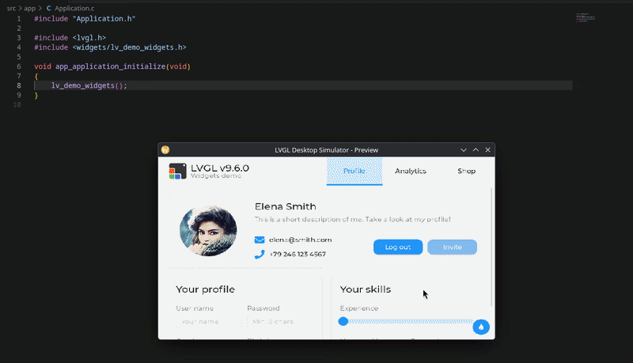
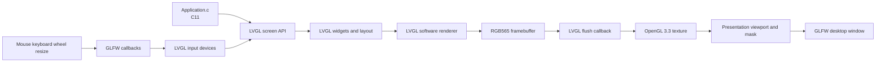

# LVGL Desktop Simulator

### Build, preview, and refine LVGL screens on a desktop before moving to real hardware.

A small hardware-free simulator for developing LVGL interfaces with the same C APIs used on an embedded target. The application layer stays in C11, while GLFW and OpenGL 3.3 provide the desktop window, input bridge, and presentation surface.

## Visual showcase



## The idea

> **Edit an LVGL screen on your PC, see the result immediately, and move to hardware when the interface is ready.**

## Architecture



LVGL owns widgets, layout, styles, and pixels. GLFW owns the native window and raw events. OpenGL only presents the framebuffer produced by LVGL; it does not draw a second UI.

## Start in seconds

```text
git clone --recurse-submodules https://github.com/YuriAlvesBordin/LVGL-Desktop-Simulator
cd LVGL-Desktop-Simulator/scripts
./

```

Start automatic rebuild and relaunch while editing the screen:

```text
cmake --build build/debug --target live-preview
```

On Windows, use `scripts\live_preview.bat`. The complete installation path is documented in [Installation](docs/guide/installation.md).

## Make it yours

Change `src/app/Application.c` to call the LVGL screen, example, or demo you want to develop. Leave the integration layer untouched.

The canvas, window, presentation, and branding are configured with `#define` values in `config/display_config.h`:

| Setting | Purpose |
|---|---|
| `LVGL_GLFW_LVGL_WIDTH` / `LVGL_GLFW_LVGL_HEIGHT` | Logical LVGL resolution |
| `LVGL_GLFW_WINDOW_WIDTH` / `LVGL_GLFW_WINDOW_HEIGHT` | Native desktop window size |
| `LVGL_GLFW_PRESENTATION_MODE` | `0` for stretch or `1` for preserve-aspect-ratio |
| `LVGL_GLFW_SCREEN_SHAPE` | `0` for rectangle, `1` for rounded, or `2` for circle |
| `LVGL_GLFW_CORNER_RADIUS` | Rounded-corner radius |
| `LVGL_GLFW_WINDOW_TITLE` | Native window title; preview adds ` - Preview` |
| `LVGL_GLFW_ICON_PATH` | Optional embedded BMP on Unix or ICO on Windows |
| `LVGL_GLFW_MAX_FPS` | Maximum frame rate; `0` disables the additional software limit |

For a circular screen, use a square LVGL canvas and preserve-aspect-ratio mode. See [CMake and presets](docs/reference/cmake.md) for the configuration map.

## Documentation

| Guide | Use it when you need to… |
|---|---|
| [Installation](docs/guide/installation.md) | Install dependencies on Unix or Windows |
| [First run](docs/guide/first-run.md) | Configure and launch the simulator |
| [Selecting LVGL content](docs/guide/selecting-lvgl-content.md) | Switch between official examples and demos |
| [Live preview](docs/development/live-preview.md) | Understand automatic rebuild and relaunch |
| [CMake and presets](docs/reference/cmake.md) | Understand config headers, build targets, and presets |
| [Architecture](docs/reference/architecture.md) | Understand application, LVGL, GLFW, and OpenGL boundaries |
| [Releases](docs/guide/releases.md) | Build a standalone Linux or Windows release |
| [Validation report](VALIDATION.md) | Review the current validation coverage |
