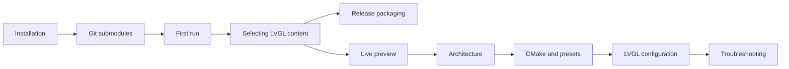

# Documentation

This documentation is organized around the complete desktop validation workflow: install the toolchain, build the simulator, select LVGL content, understand the backend boundary, and iterate with live preview.

## Reading path

| Section | Document | Main question |
|---|---|---|
| Guide | [Installation](guide/installation.md) | What needs to be installed? |
| Guide | [Git submodules](guide/dependencies.md) | How are LVGL and GLFW obtained and pinned? |
| Guide | [First run](guide/first-run.md) | How do I build and launch the simulator? |
| Guide | [Selecting LVGL content](guide/selecting-lvgl-content.md) | How do I switch examples and demos? |
| Guide | [Releases](guide/releases.md) | How do I build and distribute the standalone executable? |
| Development | [Live preview](development/live-preview.md) | How do I see changes automatically? |
| Development | [Contributing and extending](development/contributing.md) | Where should a change live? |
| Reference | [Architecture](reference/architecture.md) | How does the framebuffer and input bridge work? |
| Reference | [CMake and presets](reference/cmake.md) | How are targets and builds organized? |
| Reference | [LVGL configuration](reference/lvgl-config.md) | How does `lv_conf.h` control the project? |
| Troubleshooting | [Common issues](troubleshooting/common-issues.md) | How do I isolate failures? |

The top-level [README](../README.md) is the project landing page. The top-level [validation report](../VALIDATION.md) records the checks performed against the repository.
