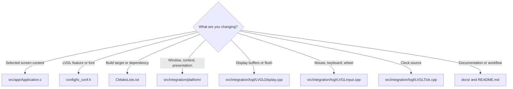

# Contributing and extending

This repository is intentionally small at the application boundary and explicit at the integration boundary. Changes should preserve that distinction so the simulator remains useful as a reusable LVGL prototyping base.

## Choose the correct layer

| Change | Preferred location | Avoid changing |
|---|---|---|
| Select an official LVGL example or demo | `src/app/Application.c` | Integration sources |
| Enable a font, widget, layout, or demo feature | `config/lv_conf.h` | Vendored LVGL source |
| Change compiler standards or targets | Relevant `CMakeLists.txt` | Ad hoc shell-only build rules |
| Change the presentation pipeline | `src/integration/platform/` and `src/integration/lvgl/` | Application code |
| Explain the workflow | `docs/` and `README.md` | Large inline code comments |

## Application changes

The application target is C11. It should remain a small adapter that selects LVGL content. Official examples and demos belong under the LVGL submodule and should not be copied into the project application directory.

When a new screen needs project-specific behavior, keep the composition in the application layer and use LVGL APIs directly. Do not call GLFW, OpenGL, GLAD, or window-system APIs from application code.

## Integration changes

The integration target is C++20 and uses RAII for GLFW and OpenGL resources. Integration changes should preserve the existing ownership model, the OpenGL 3.3 core-profile request, the RGB565 framebuffer contract, and the single-threaded LVGL loop.

A backend change should be accompanied by a focused manual runtime check. A visual change should not be implemented by drawing widgets outside LVGL.

## Configuration changes

Configuration changes belong in the related header under `config/`. `config/lv_conf.h` controls LVGL features, `config/display_config.h` controls desktop presentation, and `config/project_config.h` controls project and dependency policy. Enabling a feature may increase build time, memory use, or the set of compiled official content units.

After changing a configuration definition, use a clean build directory when diagnosing generated-state problems. The relationship between CMake and `lv_conf.h` is described in [LVGL configuration](../reference/lvgl-config.md).

## Documentation expectations

Public workflow changes should update the relevant Markdown guide. Keep README content focused on orientation and move detailed procedures into the modular documents under `docs/`.

Prefer references to source files, targets, flags, and definitions over large embedded source listings. Keep prose, tables, and Mermaid diagrams as the primary explanation format.

## Pull request checklist

| Question | Expected answer |
|---|---|
| Is the application/backend boundary preserved? | Yes |
| Is LVGL still the only UI renderer? | Yes |
| Is OpenGL 3.3 still requested? | Yes |
| Are source comments necessary? | Only when the code cannot be made self-explanatory |
| Are docs written in English? | Yes |
| Does the change have a validation path? | Yes |
| Does live preview still observe the affected path? | Yes, or the documentation explains why not |
