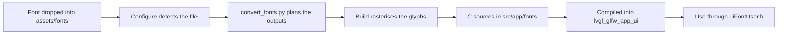

# Custom fonts

Drop any normal PC font (`.ttf`, `.otf`, or `.woff`) into `assets/fonts/` and the build converts it into an LVGL C source, compiles it into the UI library, and registers it for the application. The pipeline is pure Python (FreeType through the `freetype-py` module); it does not need Node.js or the `lv_font_conv` tool that the LVGL project itself uses.

## Pipeline



At configure time `cmake/Fonts.cmake` globs `assets/fonts/*.ttf|*.otf|*.woff` and asks `scripts/convert_fonts.py --plan` which C files it would generate. The answers are wired as proper build outputs, so changing a font file or `fonts.toml` regenerates and recompiles it on the next build. Removing a font removes its generated source on the next conversion, and the registry is rewritten to match.

## Requirements

| Requirement | Notes |
|---|---|
| Python 3.9 or newer | Reading `fonts.toml` uses `tomllib`, which needs 3.11+; without a `fonts.toml` the defaults apply |
| `freetype-py` module | Installed with pip or a distribution package, see [Installation](installation.md) |

If the interpreter or module is missing, the build keeps compiling any already generated sources in `src/app/fonts/` and warns; it fails with install instructions only when a conversion is actually required and impossible.

## Quick start

1. Copy a font into the folder:

```text
cp MyFont-Regular.ttf assets/fonts/
```

2. Build the project as usual (the font is converted and compiled automatically):

```text
cmake --preset debug
cmake --build --preset debug-build
```

3. Use it from application code:

```c
#include <fonts/uiFontUser.h>

lv_obj_set_style_text_font(label, &lv_font_my_font_regular_16, LV_PART_MAIN);
```

The generated symbol name is `lv_font_<sanitized file name>_<size>`, where non alphanumeric characters become underscores. `MyFont-Regular.ttf` at 16 px therefore becomes `lv_font_my_font_regular_16`.

## Choosing sizes and glyph coverage

Without configuration every font is converted at 16 px, 4 bpp, with ASCII plus the Latin-1 accented characters (`0x20-0x7F,0xA0-0xFF`). Create `assets/fonts/fonts.toml` to change that:

```toml
[defaults]
size = 16
bpp = 4

[files."MyFont-Regular.ttf"]
sizes = [14, 16, 24]

[files."MyIcons.ttf"]
size = 20
ranges = ["0xE000-0xE0FF"]
```

| Key | Applies to | Meaning |
|---|---|---|
| `size` | defaults and files | One output size in px (4 to 128) |
| `sizes` | files | Several output sizes from one file (one C source each); cannot be combined with `size` |
| `bpp` | defaults and files | Anti-aliasing depth: `1`, `2`, `4` (matches the built-ins) or `8` |
| `ranges` | defaults and files | Unicode ranges (`"0x20-0x7F"`), single codepoints (`"0x2022"`) or literal characters (`"E"`); replaces the defaults |
| `symbols` | defaults and files | Literal characters added on top of the ranges |

After creating `fonts.toml` for the first time, re-run the configure step (or touch any font file) so CMake notices it; later edits are picked up automatically.

## Using the generated fonts

Each font is declared by the generated header `src/app/fonts/uiFontUser.h`, and every font is also registered under its short name (the symbol without the `lv_font_` prefix):

```c
#include <fonts/uiFontUser.h>

/* Direct use through the generated declaration */
lv_obj_set_style_text_font(title, &lv_font_montserrat_medium_24, LV_PART_MAIN);

/* Or look a font up by name at runtime */
const lv_font_t * body = ui_font_user_find("montserrat_medium_16");
if(body != NULL) {
    lv_obj_set_style_text_font(text, body, LV_PART_MAIN);
}
```

The simulator's UI app (for example `src/app/SmarthWatch/`) centralises fonts behind role macros such as `UI_FONT_CLOCK` in `uiFont.h`. To make a screen use a converted font, point the role at it:

```c
#define UI_FONT_CLOCK  (&lv_font_montserrat_medium_48)
```

## What gets generated

| File | Content |
|---|---|
| `src/app/fonts/lv_font_<name>_<size>.c` | The font: glyph bitmaps, descriptors, cmap tables and the public `lv_font_t` |
| `src/app/fonts/uiFontUser.h` | `LV_FONT_DECLARE` for every font plus the registry API |
| `src/app/fonts/uiFontUser.c` | The `ui_font_user_registry[]` table and `ui_font_user_find()` |

These are generated artifacts: do not edit them by hand, the build recreates them from `assets/fonts/`.

## How it works

The converter loads the font with FreeType, renders every requested codepoint as an 8-bit coverage bitmap, quantises it to the configured bits per pixel and packs it in the exact bit stream that `lv_font_fmt_txt.c` reads (MSB first, no row padding, `stride = 0`). Advance widths come from the unhinted linear metrics so letter spacing keeps the fractional widths designed into the font, while the bitmap itself uses light vertical hinting by default (`--hinting` selects `none`, `normal`, `auto` or `light`). Line metrics derive from the fractional `hhea` ascent and descent, and the emitted `lv_font_t` matches the anatomy of the built-in `lv_font_montserrat_16.c`, including the LVGL 9.6 `cap_height`/`x_height` fields and `static_bitmap = 1`.

## Limitations

| Limitation | Detail |
|---|---|
| No kerning | Kern pairs are not embedded; `kern_dsc` is `NULL` |
| No compression | Bitmaps are plain (`LV_FONT_FMT_TXT_PLAIN`), no RLE prefilter |
| No WOFF2 | FreeType in `freetype-py` reads TTF, OTF and WOFF 1 |
| 1 MB bitmap budget | `LV_FONT_FMT_TXT_LARGE` is 0, so bitmaps must stay under 1 MB per font |
| No color or bitmap fonts | Color emoji and strike-only fonts are rejected |

## Self-test

The converter can prove its output against the LVGL reference data: it re-converts the Montserrat font that generated the built-in `lv_font_montserrat_16.c` and compares advances, boxes, positions and bitmaps glyph by glyph.

```text
python3 scripts/convert_fonts.py --verify
```

## Troubleshooting

| Symptom | Resolution |
|---|---|
| Build warns that no Python interpreter can import `freetype` | Install the module for the interpreter CMake finds: `pip3 install freetype-py` (see [Installation](installation.md)) |
| Missing accented characters at runtime | Extend `ranges` in `fonts.toml`, e.g. `["0x20-0x7F", "0xA0-0xFF"]` |
| Error about an LVGL built-in font name | Rename the file; `Montserrat-Medium.ttf` at 16 px would shadow `lv_font_montserrat_16` |
| Error about the 1 MB bitmap limit | Reduce sizes, bpp or the number of codepoints |
| New `fonts.toml` ignored by the build | Re-run the configure step once; afterwards its edits are tracked automatically |
