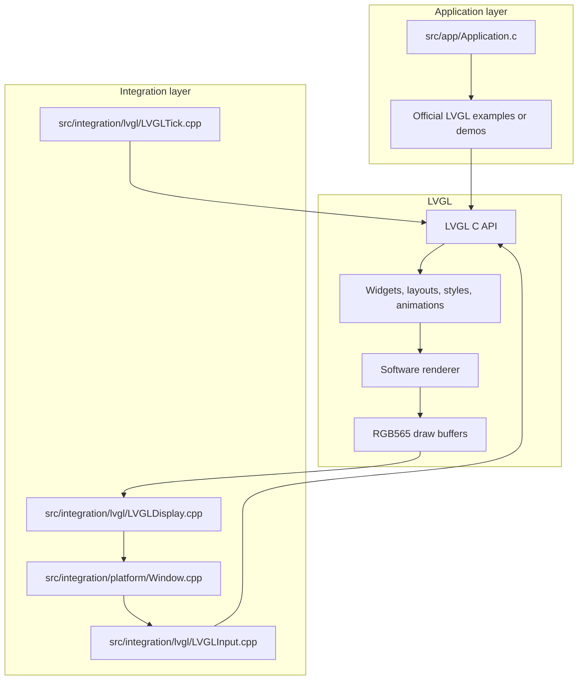
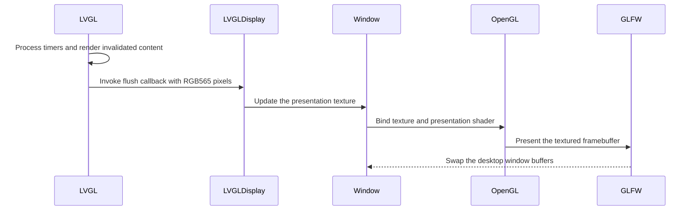
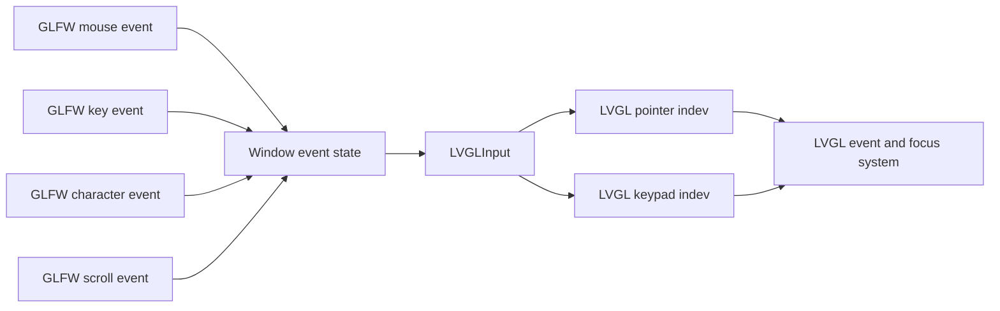
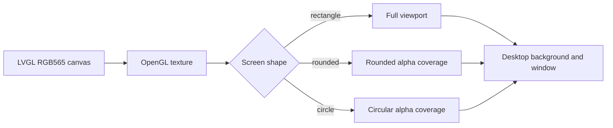
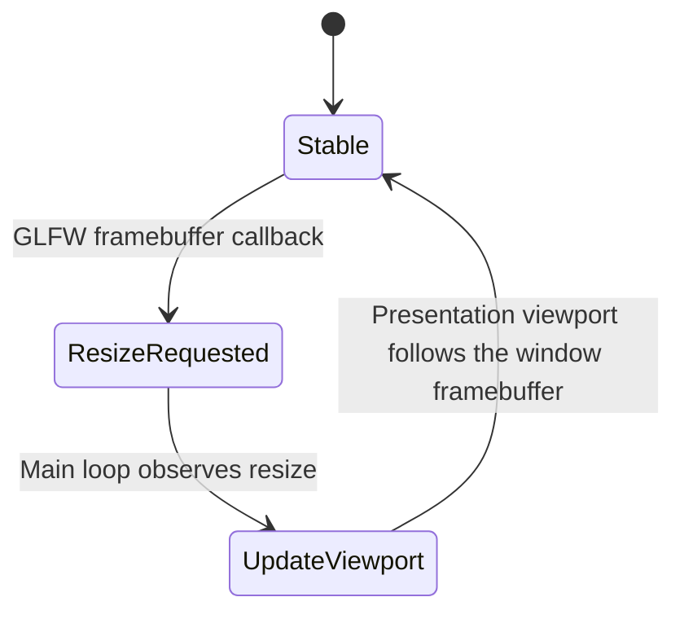

# Architecture

The simulator is split into a stable desktop integration layer and a deliberately small application entry point. The split makes the repository useful as a personal LVGL prototyping base: application code can change frequently without exposing the window, context, buffer, or input implementation.

## High-level boundary

## Ownership model

| Concern | Owner | Boundary |
|---|---|---|
| Widget creation | LVGL and the selected official content | Application calls LVGL APIs only |
| Layout calculation | LVGL | Application does not calculate pixels manually |
| Style resolution | LVGL | Application selects styles through LVGL APIs or official content |
| Rasterization | LVGL software renderer | OpenGL does not draw widgets |
| Logical display resolution | `config/display_config.h` and `LVGLDisplay` | Defines the LVGL canvas independently of the native window |
| Framebuffer memory | `LVGLDisplay` and LVGL | The display bridge owns its logical-resolution buffers |
| Texture upload | `Window` | Uploads the LVGL framebuffer only |
| Final presentation | OpenGL 3.3 and GLFW | Presents the texture in a desktop window |
| Screen shape mask | OpenGL presentation shader | Clips transparent corners or circular exterior without drawing UI widgets |
| Window geometry persistence | `Window` | Saves and restores user-level position and client size |
| Mouse and keyboard capture | GLFW | Converts raw events into bridge state |
| LVGL input devices | `LVGLInput` | Exposes pointer and keypad devices to LVGL |
| Time source | `LVGLTick` | Connects a monotonic desktop clock to LVGL |
| Screen selection | `Application.c` | Calls one official example or demo |

## Pixel pipeline

The integration never interprets individual widgets. It receives the completed LVGL framebuffer and presents it as a texture. This preserves the distinction between UI rendering and desktop presentation. The texture keeps the configured logical LVGL resolution while the presentation viewport follows the current framebuffer size. Stretch mode fills that viewport; aspect-ratio mode uses a centered fitted viewport with letterboxing when necessary. Fixed-size mode keeps one canvas pixel per framebuffer pixel: the canvas is centered without scaling and clipped when the window is smaller than the canvas, so the screen resolution always stays true to the configured LVGL resolution. The presentation fragment shader can apply a rectangle, rounded-corner, or circle mask after sampling the LVGL texture; it does not create or lay out any UI content.

## Input pipeline

The pointer device receives mouse position and button state. The window maps cursor coordinates through the fitted presentation viewport and marks pointer input as released outside letterboxed or masked regions. Scroll input is exposed through LVGL input data so compatible widgets can consume rotary-style movement. The keypad device receives navigation keys, editing keys, and Unicode characters. `LVGLInput` creates a default LVGL group before the application content is created, assigns the keypad indev to that group, and allows focusable widgets to receive physical keyboard input after pointer focus or explicit LVGL focus.

## Screen shape masks

The screen mask is a presentation concern and does not change the LVGL logical resolution. `rectangle` leaves every pixel visible, `rounded` removes the four corners with the configured radius, and `circle` keeps the largest centered circle inside the logical canvas. For circular physical displays, the application should use a square logical canvas and preserve aspect ratio.

## Resize lifecycle

Window resizing changes the native presentation surface, not the logical LVGL canvas.

The resize path is processed on the main thread. A native window resize updates the presentation framebuffer and viewport without changing the logical LVGL resolution or reallocating the LVGL buffers. The logical display is recreated only after a `config/display_config.h` change and process relaunch.

## Lifetime and shutdown

The C++ bootstrap constructs the window, initializes LVGL, installs the tick callback, creates the display and input bridge, calls the C application entry point, and enters the loop. Destruction then proceeds in the reverse direction before `lv_deinit()` and GLFW shutdown complete.

The application entry point has no ownership of GLFW resources. `Window` saves its geometry during close and loads it before creating the next native window; native Wayland compositors may override the restored position. This is the key reason a user can replace the selected LVGL example or demo without changing backend code.
