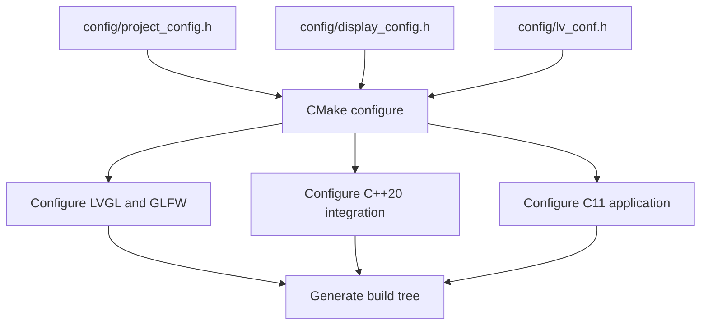

# CMake and project configuration

CMake composes the project, configures the vendored LVGL and GLFW trees, and generates the selected build directory. It is not the source of truth for simulator behaviour. User-editable values are defined with `#define` directives in the headers under `config/`.

## Configuration flow

The configuration headers are registered as CMake configure dependencies. Changing one of them causes the next build or live-preview cycle to reconfigure the build tree.

## Configuration ownership

| File | Owns | Typical changes |
|---|---|---|
| `config/project_config.h` | Project identity, language standards, static-link policy, dependency build policy, and preview polling | Project version, C11/C++20 standards, dependency policy, preview interval |
| `config/display_config.h` | Desktop presentation and window identity | LVGL resolution, window size, aspect policy, screen shape, title, icon, OpenGL profile, background colour |
| `config/lv_conf.h` | LVGL compile-time features | Colour depth, software drawing, fonts, widgets, layouts, demos, and examples |
| `config/integration_config.h` | Integration-only compile context | OpenGL-related LVGL declarations required by the desktop bridge |
| `CMakeLists.txt` | Build structure | Targets, submodules, generated resources, platform branches, and validation of header values |
| `CMakePresets.json` | Build directories and build type | Debug and Release output locations |

Generated files in a build directory, especially `CMakeCache.txt`, are derived state. Do not edit them as a configuration method.

## Display configuration

`config/display_config.h` contains the values most often changed while developing a screen.

| Define | Meaning |
|---|---|
| `LVGL_GLFW_LVGL_WIDTH` and `LVGL_GLFW_LVGL_HEIGHT` | Logical LVGL canvas and framebuffer dimensions |
| `LVGL_GLFW_WINDOW_WIDTH` and `LVGL_GLFW_WINDOW_HEIGHT` | Initial native window dimensions |
| `LVGL_GLFW_PRESENTATION_MODE` | `0` for stretch, `1` for preserve-aspect-ratio, or `2` for fixed size (1:1 pixels) |
| `LVGL_GLFW_SCREEN_SHAPE` | `0` for rectangle, `1` for rounded, or `2` for circle |
| `LVGL_GLFW_CORNER_RADIUS` | Rounded-mask radius in logical pixels |
| `LVGL_GLFW_WINDOW_TITLE` | Base native title; preview appends ` - Preview` |
| `LVGL_GLFW_ICON_PATH` | Relative-to-project or absolute BMP path on Unix, ICO path on Windows |
| `LVGL_GLFW_OPENGL_MAJOR` and `LVGL_GLFW_OPENGL_MINOR` | Requested OpenGL version; the project requires 3.3 core |
| `LVGL_GLFW_WINDOW_BACKGROUND_*` | Native window clear colour outside the LVGL presentation |
| `LVGL_GLFW_MAX_FPS` | Positive software frame-pacing limit; `0` disables the additional limit |
| `LVGL_GLFW_SWAP_INTERVAL` | VSync interval passed to GLFW; `1` enables the usual display synchronisation |

The logical LVGL dimensions remain independent from the native window dimensions. Resizing the native window changes the presentation viewport rather than recreating the LVGL display. Circle presentation is intended for a square LVGL canvas and preserve-aspect-ratio mode. The maximum FPS is an upper bound: VSync, rendering cost, and the host display can still produce a lower effective rate.

## Project and dependency configuration

`config/project_config.h` controls the build policy without requiring command-line cache overrides.

| Define | Meaning |
|---|---|
| `LVGL_GLFW_PROJECT_VERSION` | Version used by the CMake project and release packagers |
| `LVGL_GLFW_C_STANDARD` and `LVGL_GLFW_CXX_STANDARD` | Language standards for application and integration code |
| `LV_BUILD_EXAMPLES` and `LV_BUILD_DEMOS` in `config/lv_conf.h` | Whether the official LVGL content libraries are composed |
| `config/integration_config.h` | Integration-only LVGL compile definitions |
| `LVGL_GLFW_BUILD_SHARED_LIBS` and `LVGL_GLFW_GLFW_LIBRARY_TYPE` | Static or shared dependency policy |
| `LVGL_GLFW_BUILD_GLFW_*` | GLFW documentation, test, example, install, X11, and Wayland build policy |
| `LVGL_GLFW_USE_THORVG_INTERNAL` | Optional internal ThorVG build policy |
| `LVGL_GLFW_PREVIEW_INTERVAL_SECONDS` | Polling interval used by the live-preview supervisor |

The default project keeps LVGL and GLFW static so the application can be packaged without separate project-library files. The host still supplies the graphics driver, native window system, and operating-system runtime.

## Presets and workflow

| Preset | Directory | Purpose |
|---|---|---|
| `debug` | `build/debug` | Configure the development build |
| `debug-build` | `build/debug` | Build the Debug target |
| `release` | `build/release` | Configure the distribution build |
| `release-build` | `build/release` | Build the Release target |
| `live-preview` | `build/debug` | Run the visible live-preview supervisor |

The recommended workflow is to edit `config/*.h` or `src/app/Application.c`, then configure and build with the Debug preset. The application layer remains C11, while the desktop integration and bootstrap remain C++20.

## Targets

| Target | Role |
|---|---|
| `lvgl-glfw-app` | Desktop executable and C++ bootstrap |
| `lvgl_glfw_app_ui` | C11 application layer |
| `lvgl_glfw_integration` | GLFW, OpenGL, LVGL display, input, tick, and GLAD bridge |
| `live-preview` | Visible cross-platform rebuild and relaunch supervisor |
| `package-release` | Cross-platform standalone release packager |
| `fonts` | Convert fonts from `assets/fonts/` into LVGL C sources |
| `clean` | Generator-provided removal of compiled output while retaining the build tree |

Use the generator `clean` target when the configured tree should remain available. Use `python3 scripts/clear_build.py` (or `python scripts\clear_build.py` on Windows) when the complete build directory must be removed.

## Custom fonts pipeline

`src/app/CMakeLists.txt` includes `cmake/Fonts.cmake`, which converts every font in `assets/fonts/` into C sources under `src/app/fonts/` and compiles them into `lvgl_glfw_app_ui`. The conversion runs through `add_custom_command`, so an added or changed `.ttf`, `.otf`, `.woff`, or `fonts.toml` regenerates on the next build, and the `fonts` target forces a conversion pass on demand. See [Custom fonts](../guide/custom-fonts.md).

## Source of truth

The normal ownership rule is simple: edit `config/*.h` for configuration, `src/app/Application.c` for the selected LVGL screen, `src/integration/` for the desktop bridge, and `CMakeLists.txt` only for project composition. The CMake cache is a generated reflection of these files, not a second configuration interface.
