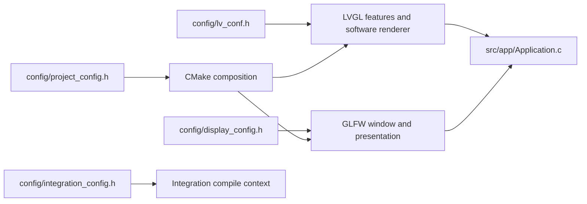

# LVGL configuration

`config/lv_conf.h` is the compile-time LVGL feature configuration used by the simulator. It is separate from the integration-only defines in `config/integration_config.h`, the desktop presentation settings in `config/display_config.h`, and the project build policy in `config/project_config.h`.

## Ownership model

| Concern | Configuration file | Consumer |
|---|---|---|
| LVGL colour depth and renderer | `config/lv_conf.h` | LVGL target and display bridge |
| LVGL fonts, widgets, layouts, and demos | `config/lv_conf.h` | LVGL target and application layer |
| Logical canvas and native window size | `config/display_config.h` | LVGL display and GLFW window |
| Presentation mode and screen shape | `config/display_config.h` | OpenGL presentation shader and input mapping |
| Window title, icon, and clear colour | `config/display_config.h` | Native window and release packagers |
| Project standards and dependency policy | `config/project_config.h` | Root CMake configuration |
| Integration-only LVGL compile context | `config/integration_config.h` | C++20 integration target |
| Selected screen content | `src/app/Application.c` | C11 application target |

## Current LVGL settings

| Definition | Value | Purpose |
|---|---:|---|
| `LV_COLOR_DEPTH` | `16` | RGB565 framebuffer output |
| `LV_COLOR_16_SWAP` | `0` | Native byte order for the presentation path |
| `LV_USE_DRAW_SW` | `1` | LVGL software renderer |
| `LV_USE_OS` | `LV_OS_NONE` | Single-threaded main loop |
| `LV_DEF_REFR_PERIOD` | `16` | Default refresh period in milliseconds |

OpenGL presents the RGB565 framebuffer produced by LVGL. It is not a second widget or layout renderer.

## Enabled feature families

| Family | Representative definitions |
|---|---|
| Text | `LV_USE_LABEL`, `LV_FONT_DEFAULT` |
| Controls | `LV_USE_BUTTON`, `LV_USE_BAR`, `LV_USE_SLIDER` |
| Layout | `LV_USE_FLEX`, `LV_USE_GRID` |
| Theme | `LV_USE_THEME_DEFAULT` |
| Widgets demo | `LV_USE_DEMO_WIDGETS` |
| Fonts | `LV_FONT_MONTSERRAT_14`, `LV_FONT_MONTSERRAT_16`, `LV_FONT_MONTSERRAT_24` |

The default application shows a simple button. To run the LVGL widgets demo, edit `src/app/Application.c` to call `lv_demo_widgets()`, which requires the widgets demo, FLEX, GRID, its control set, and the enabled fonts. The official examples and demos are kept in the LVGL submodule and are selected from `src/app/Application.c`.

## Build content

`LV_BUILD_EXAMPLES` and `LV_BUILD_DEMOS` in `config/lv_conf.h` control whether CMake composes the `lvgl::examples` and `lvgl::demos` targets. These flags are read directly from the LVGL header, so there is no second project-level copy to keep aligned.

`config/integration_config.h` contains the three compile definitions required only while compiling the desktop bridge. It is applied to that target without changing the LVGL library feature configuration.

## Editing workflow

Edit `config/lv_conf.h` when enabling or disabling an LVGL feature, font, widget, layout, renderer option, or official content family. Edit `config/display_config.h` for the logical canvas, window, presentation, shape, title, and icon. Edit `config/project_config.h` for project version, language standards, dependency policy, and preview timing. Edit `config/integration_config.h` only when changing the compile context required by the desktop bridge.

Reconfigure or build the selected preset afterwards so CMake can regenerate the target graph. Do not modify the vendored LVGL source for application work. Do not put screen composition in these headers; screen composition belongs in `src/app/Application.c`. This project uses LVGL C APIs and does not include LVGL XML or a generated configuration editor.
