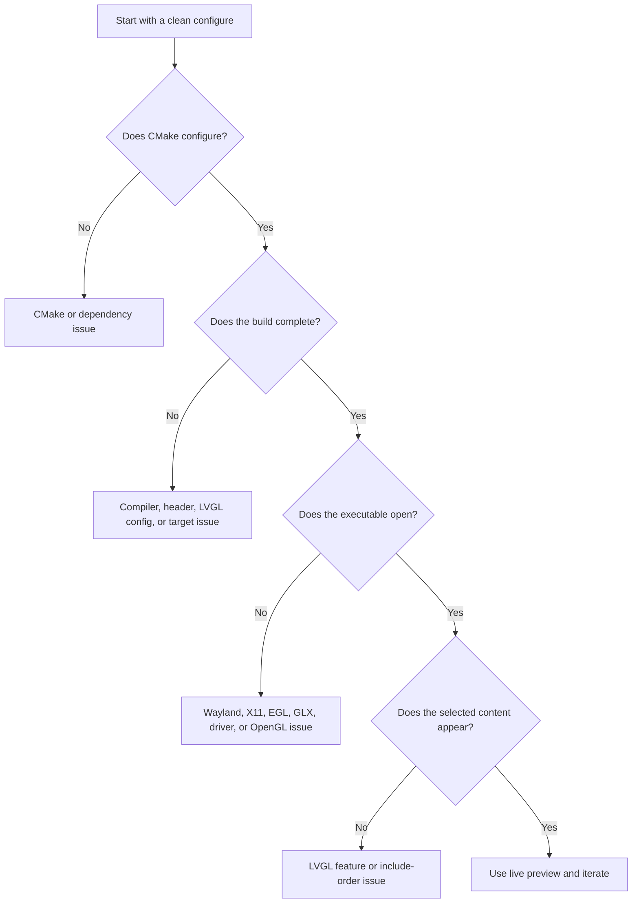

# Troubleshooting

This guide separates build failures from runtime graphics failures. The distinction matters because a project can compile correctly while the host graphics session cannot create the requested OpenGL context.

## Diagnostic decision tree

## Demo function has an implicit declaration

A C11 error such as `implicit declaration of function 'lv_demo_widgets'` means the compiler saw the call but not the public declaration.

Check the following files and conditions:

| Check | Expected state |
|---|---|
| `src/app/Application.c` | Includes `lvgl.h` before the selected demo header |
| Demo header | Uses the path exposed by the `lvgl::demos` include directory, such as `widgets/lv_demo_widgets.h` |
| `config/lv_conf.h` | Enables `LV_BUILD_DEMOS`, `LV_USE_DEMO_WIDGETS`, and its layout requirements |
| `src/app/CMakeLists.txt` | Links `lvgl::demos` |
| Build directory | Was configured again after the CMake or configuration change |

A clean rebuild is the fastest way to remove stale generated state after changing these conditions.

## CMake cannot find a system dependency

The LVGL and GLFW submodules remove the need to install those libraries separately, but GLFW still needs platform development headers and OpenGL development files. On Arch Linux, revisit the package list in [Installation](../guide/installation.md).

A missing Wayland or X11 package is usually visible during the GLFW configure step. The configure output identifies which platform support was included.

## The build shows many raw-string warnings

Some optional upstream LVGL shader assets are stored in `.c` files containing C++ raw-string literals. The project CMake handles the two affected assets with a localized compiler-mode override: GNU C11 on GCC/Clang and C++ source mode on MSVC. This keeps the application C11 and integration C++20 boundaries unchanged while removing the upstream diagnostics from a clean project build.

If an existing build directory still prints the old warnings, reconfigure it or remove it and configure again. A real failure is identified by `error:`, a failed target, or a non-zero build result. Always inspect the first error after the warning stream rather than treating every warning as a build failure.

## `GLXBadFBConfig` on NVIDIA and Wayland

A `GLXBadFBConfig` failure means the application was attempting an X11 or XWayland GLX context that the host stack could not provide. This is a host graphics-session problem, not an LVGL screen problem.

The current GLFW integration prefers the native Wayland platform when `WAYLAND_DISPLAY` is present and uses X11 when only `DISPLAY` is available. On NVIDIA Wayland systems, verify the driver before investigating the project.

| Check | Healthy signal |
|---|---|
| `nvidia-smi` | The command succeeds and kernel/userspace versions match |
| `XDG_SESSION_TYPE` | Reports `wayland` for a Wayland session |
| `WAYLAND_DISPLAY` | Is set in a native Wayland session |
| `egl-wayland` | Installed when using NVIDIA Wayland |
| Kernel module | Matches the installed NVIDIA userspace libraries |

After updating an NVIDIA package, reboot before testing again. `glxinfo -B` mainly exercises GLX through X11 or XWayland; an EGL-oriented diagnostic is more relevant to native Wayland.

## The demo compiles but shows nothing

Check that the selected LVGL feature is enabled in `config/lv_conf.h`. Official examples and demos commonly use preprocessor guards, so a function can be declared or compiled conditionally based on `LV_USE_*` definitions.

To run `lv_demo_widgets()`, edit `src/app/Application.c` to call `lv_demo_widgets()` (uncomment the line and comment out the button code), then verify `LV_USE_DEMO_WIDGETS`, `LV_USE_FLEX`, `LV_USE_GRID`, the required widgets, and the fonts used by the demo. Reconfigure and rebuild after changing the configuration header.

## Live preview does not rebuild

Confirm that the edited file is under one of the watched paths. The supervisor watches `src/app/`, `src/integration/`, `config/`, the root CMake files, the two component CMake files, and the `scripts/*.py` helpers.

The supervisor uses polling. The default interval is defined by `LVGL_GLFW_PREVIEW_INTERVAL_SECONDS` in `config/project_config.h`. If a build fails, the previous process is kept alive and the error remains in the terminal.

## The visible window closes immediately

Run the executable directly with a terminal attached and inspect its output. The error messages from `src/main.cpp` identify the failed stage.

If the process exits before creating a window, separate the problem into context creation, LVGL display initialization, LVGL input initialization, and application content initialization.

## Clean-room recovery

When the cause is unclear, remove the selected build directory and configure again with the Debug preset. This resets generated CMake state while preserving the source and configuration files.

The repository validation commands are collected in [First run](../guide/first-run.md).
